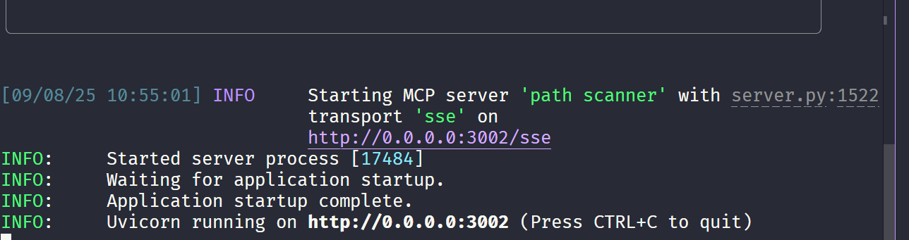
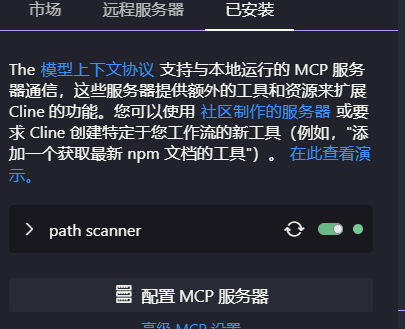
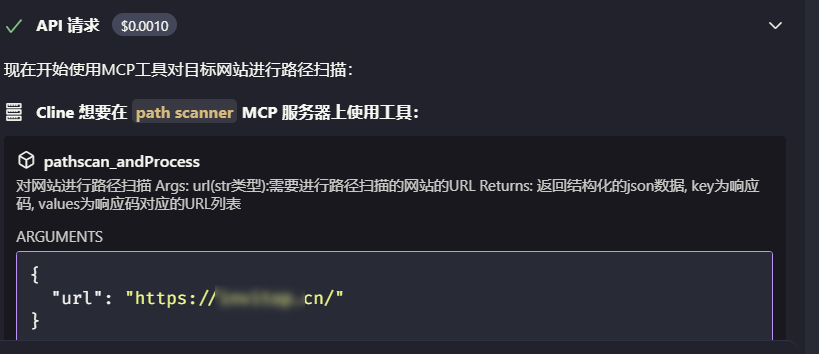
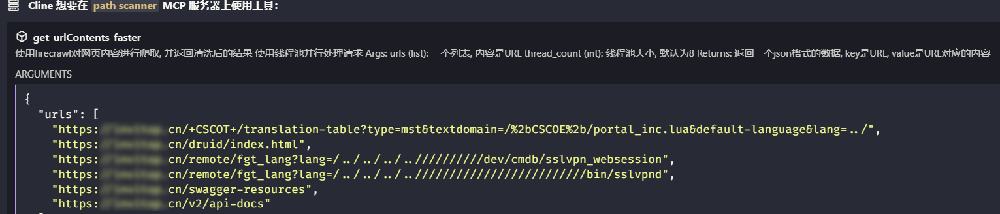

## 使用方法
1. 为dirsearch安装依赖: 
   进入dirsearch目录,
   执行安装依赖的命令(这里我图省事, 选择把依赖安装在了全局环境中)
   ```bash
   pip install -r .\requirements.txt
   ```
2. 在全局环境中再安装一个
   ```bash
   pip install setuptools
   ```
3. 安装[uv](https://docs.astral.sh/uv/)管理器: 这是一个极快的 Python 包和项目管理器，用 Rust 编写
   ```bash
   powershell -ExecutionPolicy ByPass -c "irm https://astral.sh/uv/install.ps1 | iex"
   ```
4. 为MCP服务安装依赖
   ```
   uv sync
   ```
5. 在本地部署[firecrawl](https://www.firecrawl.dev/): 这是一个AI爬虫工具, 包含有数据清晰的功能,支持本地docker部署.
   **参考文章**:
   - https://www.cnblogs.com/skystrive/p/18893148
   - https://docs.firecrawl.dev/contributing/guide

   **故障排除:**
   在使用本地部署的firecrawl进行网页爬取的时候, 返回`Unauthorized`的解决方法:
   修改.env配置文件中的字段-> `USE_DB_AUTHENTICATION`的值设为`false`

   可以直接使用我给的`.env`文件

   测试你的`firecrawl`正在运行:
   打开网址: `http://{firecrawl server IP}:3002/test`

   如果出现了`Hello, world!`, 则说明服务正常运行了

6.编辑你的`config.py`文件
   `FIRECRAWL_HOST`是你的firecrawl运行的HOST地址
   `GLOBAL_PYTHON_PATH`是你的全局Python地址-> 获取全局Python地址: 在cmd中输入`where python`

7. 启动你的MCP服务
   ```bash
   uv run main.py
   ```
   
   出现如下日志说明你的服务启动成功了
8. 在`cline`中添加这个服务

   直接编辑配置文件:
   ```json
   {
      "mcpServers": {
         "path scanner": {
            "url": "http://127.0.0.1:8000/sse",
            "disabled": false,
            "autoApprove": [],
            "timeout": 1800
         }
      }
   }
   ```
   
   
   这样就说明你的MCP server可以被cline使用了
   

## Prompt
你是一个网站安全助手。请调用已有的MCP服务对指定网站进行扫描，并返回结构化结果（表格形式）。
根据MCP扫描结果：
提取并总结网站所使用的技术栈；
根据扫描报告中的风险等级，分类整理网站的漏洞信息（高危/中危/低危）；
对于报告中标记为高危漏洞的相关URL，请进一步读取该URL的页面内容，并生成内容摘要；
最终请将数据汇总为以下结构输出：
技术栈
漏洞信息（按严重程度分类）
高危漏洞相关的URL及内容摘要
目标网站URL: 

## 效果展示




## TODO:
服务端尚未初始化完成就收到了客户端的请求, 解决办法: 在正式的使用服务之前init一下服务

## 参考:
此项目灵感来自于项目[ai_dirscan](https://github.com/Elitewa/ai_dirscan)
